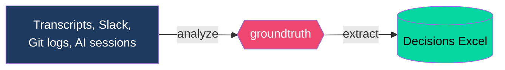
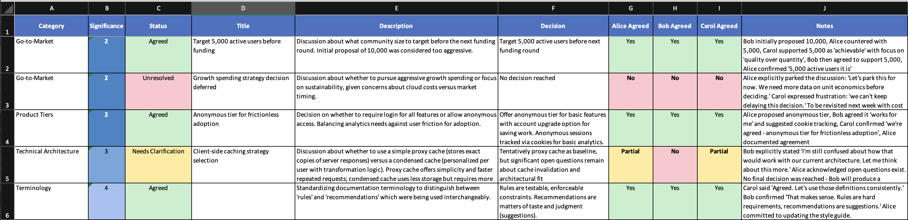

# Groundtruth

> **Your company makes hundreds of decisions a week. How many does your team actually remember?**

Decisions happen everywhere—standups, Slack threads, PR reviews, design docs, AI coding sessions. By Friday, nobody remembers what was decided Monday.

**Groundtruth captures it all.** Feed in transcripts, chat logs, or meeting notes. Get a structured spreadsheet showing every decision, who made it, and whether everyone actually agreed.

More importantly: it tracks **non-decisions**—the parked topics, unresolved debates, and false agreements where someone nodded but never signed off.

**Result: 10x better team alignment.**



---

## Example Output

[](https://github.com/rsnodgrass/groundtruth/raw/refs/heads/main/examples/sample-output-Decisions.xlsx)

*Click to download the sample Excel file • See [`examples/`](examples/) for sample transcripts*

---

## Why This Matters Now

Pre-2023, teams made 10-20 significant decisions per week. Now, with AI-assisted development, that's 10x higher. Architecture decisions happen mid-coding session. Product pivots emerge from midnight Slack threads.

**The fastest teams aren't those making the most decisions. They're the ones where everyone knows what was decided.**

---

## Key Features

- **Multi-source** — Process meetings, Slack, git logs, AI sessions—anything text-based
- **Non-decision tracking** — Capture what hasn't been decided, not just what has
- **False agreement detection** — Identify when people nod but don't actually agree
- **Significance-based rules** — Conservative agreement assessment for critical decisions
- **Agent-readable CSV** — Coding agents can read CSV output to learn what's been decided before starting new tasks
- **Bring your own LLM** — Works with Claude Code (recommended), Anthropic API, OpenAI, or LiteLLM
- **[Decision Frameworks](docs/decision-frameworks.md)** — Define who must agree on what, with layered team → project → meeting rules

---

## Decision Frameworks

The real power of Groundtruth comes from **Decision Frameworks**—plain English documents that define how your team makes decisions.

```bash
# Layer frameworks: team defaults → project overrides → meeting context
groundtruth extract meeting.txt --framework team.md --framework project.md --framework meeting.md
```

A framework specifies:
- **Who** your decision-makers are (Alice is CEO, Bob is CTO...)
- **What** agreement is required ("Tech Sig 1: Alice AND Bob MUST agree")
- **How** to handle ambiguity ("Default if unclear: No")

**[Create your team's Decision Framework →](docs/decision-frameworks.md)**

---

## Use Cases

**Daily Decision Digest** — Process everything from today with your team framework:
```bash
groundtruth process today/ --framework team.md
```

**Weekly Alignment Report** — Layer team + project frameworks:
```bash
groundtruth process week-of-dec-16/ --framework team.md --framework project.md --pattern "*.txt"
```

**AI Coding Session Audit** — Capture architectural decisions with full context:
```bash
groundtruth extract claude-session.txt --framework team.md --framework project.md --framework meeting.md
```

**Cross-Team Sync** — Use company-wide framework for multi-team alignment:
```bash
groundtruth process q4-planning/ --framework company.md --framework cross-team-sync.md
```

**Board Updates** — Professional decision tracking for governance:
```bash
groundtruth process board-meetings/ --framework board.md --output board-decisions.xlsx
```

---

## Quick Start

```bash
# Install
pip install groundtruth

# Extract decisions from a transcript
groundtruth extract meeting-transcript.txt

# Process a folder of meetings
groundtruth process meetings/2025-12-15/
```

**[Full installation guide →](docs/getting-started.md)**

---

## Documentation

| Guide | Description |
|-------|-------------|
| **[Decision Frameworks](docs/decision-frameworks.md)** | **Start here** — Define who must agree on what for your team |
| **[Getting Started](docs/getting-started.md)** | Installation, first extraction, understanding output |
| **[Configuration](docs/configuration.md)** | YAML config, LLM providers, Claude Code integration |
| **[CLI Reference](docs/cli-reference.md)** | All commands and options |
| **[Decision Tracking Guide](docs/decision-tracking-guide.md)** | Significance scale, agreement rules, output format |
| **[Meeting Best Practices](docs/meeting-best-practices.md)** | Run meetings that produce great extraction |
| **[Contributing](docs/contributing.md)** | Development setup, testing, how to contribute |

---

## Requirements

- **Speaker attribution in transcripts** — Most transcription services ([Fireflies](https://app.fireflies.ai/login?referralCode=c6pFou0hDy), [Otter.ai](https://otter.ai/referrals/LL5QS7E8)) provide this automatically
- **Claude Code** — Recommended for decision extraction (if you use anything else you are on your own to figure out how to make this work!). Install from https://claude.ai/code
- **Python 3.12+** — Needed for actually running the actual Groundtruth tool

---

## License

MIT License - see [LICENSE](LICENSE) for details.

## Contributing

Contributions welcome! See [docs/contributing.md](docs/contributing.md) for details.

## Support

**No support provided.** This is an unsupported open-source project. Use at your own risk. Pull requests welcome.

---

**Built for teams moving fast. Track decisions, not chaos.**
