# Groundtruth

> **Your company makes hundreds of decisions a week. How many does your team actually remember?**

In 2025, decisions happen everywhere—standups, Slack threads, PR reviews, design docs, and 3am Claude coding sessions. AI agents are now co-architects. The pace is relentless. By Friday, nobody remembers what was decided Monday.

**Groundtruth captures it all.** Dump any text into a folder—transcripts, chat exports, commit logs, meeting notes—and get a structured XLSX showing every decision, who made it, and whether everyone actually agreed.

More importantly, it tracks what **hasn't** been decided—the unresolved debates, the parked topics, the false agreements where someone nodded but never actually signed off.

The result: **10x better alignment** across your team.

> **⚠️ Built for Claude Code** — This tool is designed and tested with [Claude Code](https://claude.ai/code) as the default LLM provider. Other providers (Anthropic API, OpenAI, etc.) are supported via LiteLLM but are not actively tested. For best results, use Claude Code.

> **📝 Speaker Attribution Required** — Your meeting transcripts **must** include speaker diarization or speaker attribution (e.g., "Alice: I think we should...", "[Bob] Let's go with..."). Without knowing who said what, Groundtruth cannot track per-person agreement. Most transcription services (Otter.ai, Rev, Fireflies, Descript, etc.) provide this automatically.

---

## The Problem

Modern teams are drowning in decisions:

- **Meetings** — Zoom calls, standups, 1:1s, design reviews
- **Async channels** — Slack threads, Discord, email chains
- **Code discussions** — PR comments, architecture debates, RFC docs
- **AI sessions** — Claude coding sessions, ChatGPT brainstorms, Copilot suggestions

Decisions get made. Then forgotten. Then re-debated. Then made differently. Nobody knows what the "official" answer is anymore.

Worse: **non-decisions masquerade as decisions.** Someone says "let's do X," everyone nods, but half the room didn't actually agree. The topic resurfaces in three weeks like nothing was ever settled.

**Groundtruth gives you exactly that—including the uncomfortable truth about what's still unresolved.**

---

## How It Works

```mermaid
flowchart TB
    subgraph inputs["Dump anything text"]
        A1["Meeting transcripts"]
        A2["Slack exports"]
        A3["Git commit logs"]
        A4["PR review threads"]
        A5["AI session logs"]
        A6["Design docs"]
    end

    inputs --> process["groundtruth process ./"]

    process --> outputs

    subgraph outputs["Structured Decision XLSX"]
        B1["Decisions — What was actually agreed"]
        B2["Non-decisions — Parked, unresolved, false agreement"]
        B3["Agreement status — Who agreed / hedged / stayed silent"]
        B4["Significance — Critical 1 to Same Page 5"]
        B5["Source refs — Back to original transcript"]
    end
```



**You decide what to feed it. You decide how to use the output.**

---

## Why This Matters Now

### The Pace Has Changed

Pre-2023, a startup might make 10-20 meaningful decisions per week. Now, with AI-assisted development, that number is 10x higher. Architecture decisions happen in the middle of coding sessions. Product pivots emerge from Slack threads at midnight.

### AI Agents Are Decision-Makers Too

When Claude suggests "let's use PostgreSQL with JSONB instead of a separate Redis cache"—and you say "yeah, let's do that"—a decision was made. It's buried in a transcript nobody will read again.

### Alignment Is the Bottleneck

The fastest teams aren't the ones who make the most decisions. They're the ones where everyone **knows** what was decided. Groundtruth turns chaotic conversations into a single source of truth.

---

## Use Cases

### Daily Decision Digest
Process everything from today and see what your team actually decided:
```bash
groundtruth process today/ -f team-framework.yaml
```

### Weekly Alignment Report
Aggregate a week of meetings, Slack exports, and PR discussions:
```bash
groundtruth process week-of-dec-16/ --pattern "*.txt"
```

### AI Coding Session Audit
Feed in Claude Code session logs to capture architectural decisions made during development:
```bash
groundtruth extract claude-session-2025-12-17.txt
```

### Cross-Team Sync
When multiple teams need to align, process all sources into one decision record:
```bash
groundtruth process q4-planning/ -f company-framework.yaml
```

### Board & Investor Updates
Generate professional decision tracking for governance:
```bash
groundtruth process board-meetings/ --output board-decisions.xlsx
```

---

## Best Practices for Meetings

Groundtruth works best when meetings are run with decision-tracking in mind. A few simple habits dramatically improve extraction quality.

### State the Decision Framework Verbally

At the start of a meeting, have someone say who needs to agree on what. This gets captured in the transcript and guides extraction:

> "For this meeting, Steve and Martina need to agree on any GTM decisions, and Ajit and Ryan need to agree on technical architecture."

> "Today's decision-makers are Alice for product scope and Bob for timeline commitments."

### Be Explicit About Agreement

Instead of nodding or saying "sure," use clear language:

| Instead of... | Say... |
|---------------|--------|
| "Sure" | "I agree with that approach" |
| "Okay" | "Yes, let's do that" |
| "I guess" | "I can live with that, but I have concerns about X" |
| *silence* | "I'm not sure I agree—let's discuss" |

### Name Decisions When You Make Them

Help the tool (and your team) by explicitly calling out decisions:

> "So we're deciding to launch the beta in January. Everyone agree?"

> "Let me make sure I understand the decision: we're going with PostgreSQL, not MongoDB. Correct?"

### Park Items Explicitly

If you're tabling a discussion, say so clearly:

> "Let's park the pricing discussion for next week—we don't have enough data yet."

This gets marked as "Unresolved" rather than appearing as false agreement.

### State Your Role When Relevant

If decision authority matters, mention it:

> "As the engineering lead, I'm comfortable signing off on this technical approach."

> "I'll defer to Sarah on the legal implications since that's her area."

---

## Quick Start (MacOS)

### Prerequisites

1. **Python 3.10+** — Install via Homebrew if needed:
   ```bash
   brew install python@3.12
   ```

2. **Claude Code** — Required for decision extraction. Install from https://claude.ai/code or:
   ```bash
   # If you have npm installed
   npm install -g @anthropic-ai/claude-code
   ```

### Installation

```bash
# Install groundtruth via pip
pip install groundtruth

# Or install from source
git clone https://github.com/rsnodgrass/groundtruth.git
cd groundtruth
pip install -e .
```

### Basic Usage

```bash
# Extract decisions from a transcript (uses Claude Code CLI by default)
groundtruth extract meeting-transcript.txt

# Process all transcripts in a folder
groundtruth process meetings/2025-12-15/

# Process with date range
groundtruth process meetings/ --from 2025-12-09 --to 2025-12-15

# Generate XLSX from existing CSV
groundtruth xlsx meetings/2025-12-15/2025-12-15-Groundtruth.csv
```

## Bring Your Own Model (BYOM)

> **Note:** Claude Code CLI is the recommended and tested default. Other providers are experimental.

Groundtruth supports multiple LLM providers through LiteLLM, but is primarily designed for Claude Code:

```bash
# Default & Recommended: Claude Code CLI
# Just install Claude Code: https://claude.ai/code
groundtruth extract meeting.txt

# ⚠️ EXPERIMENTAL: Other providers (not actively tested)
# Use Anthropic API directly
export ANTHROPIC_API_KEY=your-key
groundtruth extract meeting.txt --provider anthropic --model claude-sonnet-4-20250514

# Use OpenAI
export OPENAI_API_KEY=your-key
groundtruth extract meeting.txt --provider openai --model gpt-4

# Use any LiteLLM-supported provider
groundtruth extract meeting.txt --provider litellm --model your-model
```

See `groundtruth providers` for full provider documentation.

## Custom Configuration

Create a config file to customize for your team:

```bash
# Generate config template
groundtruth init my-config.yaml -d "Alice,Bob,Carol"

# Use custom config
groundtruth extract meeting.txt --config my-config.yaml
```

Config file supports:
- **participants**: Team members and their roles
- **categories**: Decision categories for your domain
- **types**: Decision types (Tech, Legal, etc.)
- **agreement_rules**: Who must agree on what decisions
- **custom_prompt**: Additional LLM instructions
- **model_provider**: Default LLM provider

Example config:

```yaml
custom_prompt: |
  Focus on technical architecture decisions.
  Require unanimous agreement for security decisions.

participants:
  - name: Alice
    role: CEO
    required_for: [Strategy, GTM]
  - name: Bob
    role: CTO
    required_for: [Tech]
  - name: Carol
    role: Product Manager
    required_for: [GTM]

agreement_rules:
  Tech:
    requires_all: [Alice, Bob]
    description: Tech decisions require both CEO and CTO
  GTM:
    requires_all: [Carol]
    requires_any: [Alice, Bob]
    description: GTM requires PM and either CEO or CTO

model_provider: claude-code
```

## Core Concepts

### Decision Anatomy

Every decision extracted from a transcript includes:

| Field | Description |
|-------|-------------|
| **Category** | Logical grouping (Go-to-Market, Technical Architecture, etc.) |
| **Type** | Decision type (Tech, Legal, Compliance, GTM, Strategy, Marketing) |
| **Title** | Short name (3-8 words) |
| **Significance** | 1-5 scale (1=Critical, 5=Minor) |
| **Description** | Full context with problem, considerations, and outcome |
| **Decision** | What was decided, or "No decision reached" |
| **Status** | Agreed / Needs Clarification / Unresolved |
| **[Person] Agreed** | Yes / Partial / No for each participant |
| **Meeting Date** | YYYY-MM-DD |
| **Notes** | Evidence from transcript, quotes |
| **Meeting Reference** | Transcript filename(s) |

---

## Significance Scale

Decisions are rated 1-5 based on reversibility, impact, and dependencies.

| Level | Label | Meaning | Examples |
|-------|-------|---------|----------|
| **1** | Critical | Existential or near-irreversible | Company pivot; One-way-door architecture; Legal/compliance commitments; Fundraising strategy |
| **2** | Extremely Important | Foundational, difficult to change | Core architecture; Technology stack; Pricing model; Target market |
| **3** | Important | Significant impact, reversible with effort | Feature scope; API design; Data models; Third-party integrations |
| **4** | Moderate | Useful alignment, some effort to reverse | Implementation approach; Tool selection; Process decisions |
| **5** | Same Page | Easily reversible, good to be aligned | Terminology; Minor UX; File organization |

### Significance Assignment Guidelines

- **Default to 3** if unsure, then adjust
- **Lower number (more critical) if:**
  - Harder to reverse
  - More decisions depend on it
  - Bigger blast radius if wrong
  - External commitments involved (legal, customers, partners)
  - Multiple people had strong opinions
  - Discussion took significant time
- **Higher number (less critical) if:**
  - Purely internal process
  - Can change without affecting users
  - Preference rather than requirement

---

## Agreement Assessment

### Status Values

| Status | Criteria |
|--------|----------|
| **Agreed** | All parties explicitly agreed with clear evidence |
| **Needs Clarification** | Hedged agreement, terminology confusion, or implicit-only agreement |
| **Unresolved** | Topic parked, explicit disagreement, or no conclusion reached |

### Per-Person Agreement Values

| Value | Meaning | Evidence Required |
|-------|---------|-------------------|
| **Yes** | Explicitly agreed | "I agree", "I love that", "Let's do it", or proposed it |
| **Partial** | Agreed with qualifications | "Yes, to a degree", "I agree but...", "I can live with that" |
| **No** | Did not agree | Disagreed, silent, topic parked, moved on without confirming |

### Agreement Standards by Significance

**IMPORTANT: Be conservative. Default to "No" or "Partial" unless agreement is explicit.**

| Significance | Agreement Standard | When to mark "Partial" or "No" |
|--------------|-------------------|-------------------------------|
| **1 - Critical** | ALL parties must explicitly acknowledge the exact decision | Any ambiguity = No |
| **2 - Extremely Important** | ALL parties must explicitly acknowledge | Any ambiguity = No |
| **3 - Important** | Explicit acknowledgment AND zero signs of hesitation | Any hint of misalignment, confusion, or different interpretation = Partial or No |
| **4 - Moderate** | Clear alignment required; slight tolerance for ambiguity | Signs of different mental models or unresolved questions = Partial |
| **5 - Same Page** | General alignment sufficient | Only mark No/Partial if explicit disagreement |

### Conservative Assessment Rules

1. **Significance 1-2:** Require explicit verbal agreement from ALL parties.
   - "Parking" a topic = No
   - Silence = No
   - Moving on without confirmation = No
   - Any ambiguity whatsoever = No

2. **Significance 3:** ANY hint of potential misalignment = Partial or No. This includes:
   - Different terminology used by each party
   - Clarifying questions that weren't fully answered
   - Phrases like "I think we're saying the same thing" (suggests uncertainty)
   - Topic moved on without explicit "we agree on X"
   - One party seeming confused at any point

3. **Significance 4:** Similar to 3 but slightly relaxed. Mark "Partial" if:
   - Minor confusion occurred but seemed resolved
   - Different framing but apparent alignment on substance
   - One party less engaged but didn't object

4. **Significance 5:** More lenient. If discussion happened and no objection was raised, mark as "Yes".

5. **One person declaring ≠ agreement.** If Person A says "So we're doing X" and Person B doesn't explicitly confirm:
   - Sig 1-2: Person B = No
   - Sig 3-4: Person B = Partial

6. **Hedged language by significance:**
   - Sig 1-2: "To a degree" = No
   - Sig 3-4: "To a degree" = Partial
   - Sig 5: "To a degree" = Yes

7. **Topic resurfacing = false agreement.** If the same topic comes up multiple times, earlier "agreements" should be downgraded.

8. **One party overriding = No agreement.** If Person A pushes through despite Person B's objections, mark Person B as "No".

9. **Confusion signals = not agreed.** If anyone says "I'm confused", "help me understand", "wait, I thought..." → NOT agreed until explicitly resolved.

### Asymmetric Agreement Patterns

Watch for situations where one person assumes consensus while another has unvoiced reservations:
- Declarative statements treated as decisions ("So our UX has to be X")
- Unilateral "parking" of disagreements
- Moving to next topic without explicit confirmation
- One person using hedged language that doesn't register

---

## Categories

Assign each decision to ONE category:

| Category | Covers |
|----------|--------|
| **Go-to-Market** | Launch strategy, open source, GitHub stars, market positioning, pricing |
| **Product Tiers** | Offline/single-player/multiplayer/enterprise modes, login requirements, feature gating |
| **Technical Architecture** | Caching, data flow, server vs client, API design, system design |
| **Data & Privacy** | Telemetry, privacy levels, what data is collected/shared, retention |
| **Security** | Authentication, authorization, UUID model, access control, secrets |
| **Terminology** | Naming conventions, taxonomy definitions, vocabulary alignment |
| **Process** | Development workflow, deployment, team coordination, meetings |

---

## Types

Classify each decision by type:

| Type | Description |
|------|-------------|
| **Tech** | Technical implementation, architecture, tooling |
| **Legal** | Contracts, liability, terms of service, IP |
| **Compliance** | SOC 2, HIPAA, GDPR, regulatory requirements |
| **GTM** | Go-to-market, launch, distribution, partnerships |
| **Strategy** | Company direction, positioning, competitive |
| **Marketing** | Messaging, branding, content, campaigns |

---

## Output Format

### File Naming

```
meetings/YYYY-MM-DD/YYYY-MM-DD-Groundtruth.csv
meetings/YYYY-MM-DD/YYYY-MM-DD-Groundtruth.xlsx
```

### CSV Column Order

```
Category,Type,Title,Significance,Description,Decision,Status,Ryan Agreed,Ajit Agreed,Milkana Agreed,Meeting Date,Notes,Meeting Reference
```

### XLSX Formatting

**Header Row:**
- Font: Bold, white (#FFFFFF)
- Background: Blue (#4472C4)
- Alignment: Center, middle, word wrap
- Row height: 35px
- Freeze panes at A2

**Column Widths:**

| Col | Field | Width | Align |
|-----|-------|-------|-------|
| A | Category | 20 | Left |
| B | Type | 12 | Center |
| C | Title | 28 | Left |
| D | Significance | 10 | Center |
| E | Description | 55 | Left |
| F | Decision | 30 | Left |
| G | Status | 18 | Center |
| H | Ryan Agreed | 10 | Center |
| I | Ajit Agreed | 10 | Center |
| J | Milkana Agreed | 10 | Center |
| K | Meeting Date | 12 | Center |
| L | Notes | 45 | Left |
| M | Meeting Reference | 28 | Left |

**Significance Colors:** Shades of blue (vibrant = critical, near-white = minor)

| Value | Color | Hex | Font |
|-------|-------|-----|------|
| 1 | Vibrant Blue | #0B5394 | Bold white |
| 2 | Strong Blue | #3D85C6 | Bold white |
| 3 | Medium Blue | #6FA8DC | Normal |
| 4 | Light Blue | #A4C2F4 | Normal |
| 5 | Near White | #D9E6F7 | Normal |

**Status Colors:**

| Status | Color | Hex |
|--------|-------|-----|
| Agreed | Light Green | #C6EFCE |
| Needs Clarification | Light Yellow | #FFEB9C |
| Unresolved | Light Red | #FFC7CE |

**Agreement Colors:**

| Value | Color | Hex | Font |
|-------|-------|-----|------|
| No | Red | #FFC7CE | Bold |
| Partial | Orange | #FFEB9C | Bold |
| Yes | Green | #C6EFCE | Normal |

**Sorting:** Group by Category (alphabetically), then by Significance (1 first).

**Row Height:** 60px for data rows (to accommodate wrapped text).

---

## CLI Usage

```bash
# Extract decisions from a transcript (primary command)
groundtruth extract <transcript> [options]

Options:
  --output, -o PATH        Output path
  --output-name, -n NAME   Output filename (without extension)
  --config, -c PATH        YAML config file for customization
  --model, -m MODEL        LLM model to use
  --provider PROVIDER      Model provider: claude-code (default), anthropic, openai, litellm
  --csv                    Also output CSV (XLSX is always generated)
  --no-date-prefix         Disable date prefix in output filename
  --deciders, -d LIST      Comma-separated names of decision-makers
  --prompt TEXT            Custom prompt to add to extraction

# Process all transcripts in a folder
groundtruth process <folder> [options]

Options:
  --from DATE              Start date (YYYY-MM-DD)
  --to DATE                End date (YYYY-MM-DD)
  --output, -o PATH        Output path
  --output-name, -n NAME   Output filename
  --config, -c PATH        YAML config file
  --provider PROVIDER      Model provider
  --model, -m MODEL        LLM model
  --csv                    Also output CSV
  --no-date-prefix         Disable date prefix
  --deciders, -d LIST      Names of decision-makers
  --pattern GLOB           Transcript file pattern (default: *.txt)
  --from-csv               Process existing CSVs instead of transcripts

# Generate XLSX from CSV
groundtruth xlsx <csv-file> [options]

Options:
  --output, -o PATH        Output XLSX path
  --deciders, -d LIST      Names of decision-makers

# Validate a Groundtruth CSV
groundtruth validate <csv-file>

# Configuration commands
groundtruth init [output.yaml]    # Generate config template
groundtruth categories            # Show valid categories/types
groundtruth providers             # Show supported LLM providers
groundtruth template              # Print CSV header
```

### Output Naming

By default, output files are named:
- **Single transcript**: `{input-name}-Groundtruth.xlsx`
- **Multiple transcripts**: `{folder-name}-Groundtruth.xlsx`
- **Date prefix**: `2025-12-15-{name}-Groundtruth.xlsx` (default, disable with `--no-date-prefix`)
- **Custom name**: Use `--output-name` to override

---

## Integration with Claude Code

Add this to your project's `CLAUDE.md`:

```markdown
## Meeting Processing

When processing meeting transcripts, use the Groundtruth methodology:

1. Read all transcript files in the dated folder
2. Extract decisions using the significance and agreement standards
3. Generate CSV with proper columns and sorting
4. Generate formatted XLSX
5. Update root README with Groundtruth link

Reference: See Groundtruth.md for full methodology.
```

### Prompt for Claude Code

```
Review the meeting transcripts in meetings/YYYY-MM-DD/ and generate a Groundtruth report.

Create:
- meetings/YYYY-MM-DD/YYYY-MM-DD-Groundtruth.csv
- meetings/YYYY-MM-DD/YYYY-MM-DD-Groundtruth.xlsx

Apply the significance-based agreement standards. Be conservative - default to
"No" or "Partial" for Significance 1-3 unless agreement is explicit.

Participants: [List names]

Categories: Go-to-Market, Product Tiers, Technical Architecture, Data & Privacy,
Security, Terminology, Process

Types: Tech, Legal, Compliance, GTM, Strategy, Marketing
```

---

## Automatic Participant Detection

By default, Groundtruth analyzes the transcript to detect who the deciders are before extraction. This means you don't need to specify participants for each meeting.

**Detection is skipped if:**
- Participants are explicitly set via `--participants`
- Participants are defined in a framework file
- Disabled with `--no-auto-detect`

```bash
# Auto-detect participants from transcript (default)
groundtruth extract meeting.txt

# Explicitly specify deciders (skips detection)
groundtruth extract meeting.txt -d "Alice,Bob,Carol"

# Disable auto-detection
groundtruth extract meeting.txt --no-auto-detect
```

---

## Decision Frameworks

Decision Frameworks are user-provided files that customize how decisions are extracted. You can layer multiple frameworks:

1. **Team framework** - Your team's standard rules (who the deciders are, agreement requirements)
2. **Meeting framework** - Meeting-specific context (who's actually present, what to focus on)

Later frameworks override earlier ones. This lets you have consistent team defaults while customizing per-meeting.

### Using Multiple Frameworks

```bash
# Single team framework
groundtruth extract meeting.txt -f team-framework.yaml

# Layer team + meeting-specific frameworks
groundtruth extract meeting.txt -f team-framework.yaml -f meeting-notes.md

# Process folder with frameworks
groundtruth process meetings/ -f team-framework.yaml -f weekly-sync.md
```

### Framework File Formats

**YAML frameworks** (structured, typically for team framework):
```yaml
# team-framework.yaml
participants:
  - name: Alice
    role: CEO
  - name: Bob
    role: CTO

custom_prompt: |
  Focus on technical architecture decisions.
  Security decisions require unanimous agreement.

agreement_rules:
  Tech:
    requires_all: [Alice, Bob]
```

**Markdown frameworks** (free-form, typically for meeting framework):
```markdown
# Meeting Framework

Attendees: Alice (CEO), Bob (CTO), Carol (PM)

Focus on Q1 roadmap decisions.
Carol has final say on UX decisions.
```

### "Produced By" Sheet

Every generated XLSX includes a "Produced By" sheet with:
- **Tool info**: Name, repository, timestamp
- **Quick Reference**: Significance levels and agreement standards
- **Custom Framework**: User-provided customizations (if any)

This provides transparency - anyone reviewing the spreadsheet can see what criteria influenced extraction.

---

## Post-Processing Checklist

After generating Groundtruth reports:

1. **Review Significance 1-2 items** - Ensure agreement assessments are strict
2. **Flag Unresolved items** - Add to next meeting agenda
3. **Update project README** - Link to Groundtruth files
4. **Share with team** - Sync to shared drive if needed

---

## Examples

See the `examples/` folder for:
- Sample transcript
- Generated CSV
- Generated XLSX
- Edge cases and how to handle them

---

## Development

```bash
# Clone
git clone https://github.com/rsnodgrass/groundtruth.git
cd groundtruth

# Install dev dependencies
pip install -e ".[dev]"

# Run tests
pytest

# Lint
ruff check src/
```

---

## License

MIT License - see [LICENSE](LICENSE) for details.

---

## Contributing

Contributions welcome! Please read [CONTRIBUTING.md](CONTRIBUTING.md) first.

Key areas:
- Improve agreement detection heuristics
- Add support for more transcript formats
- Better handling of multi-day discussions
- Visualization and reporting features
